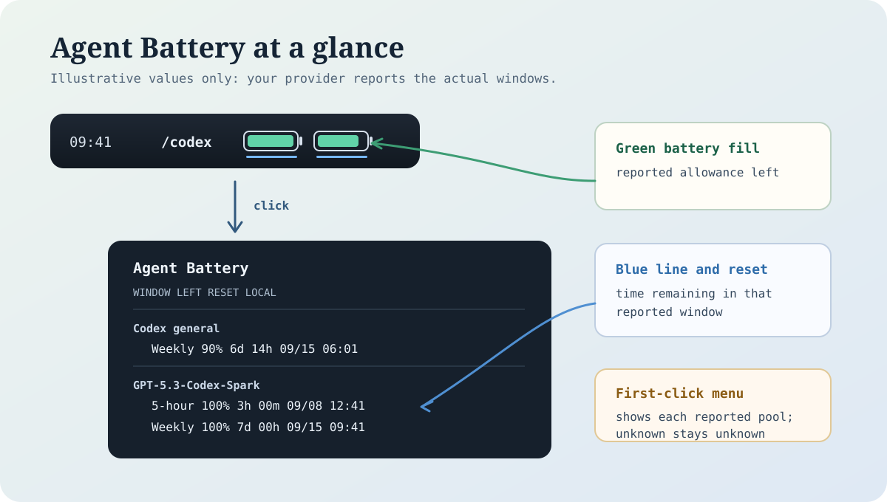
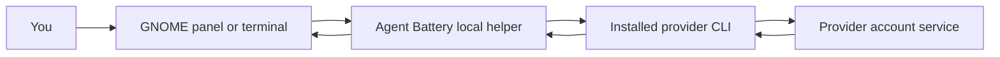

# Agent Battery

Agent Battery shows coding-agent usage in a compact GNOME panel or a terminal command.
It uses the provider CLI already signed in on your computer. No Agent Battery account,
daemon, Python package installation, or administrator access is required.



The green battery fill is the provider-reported allowance remaining. The blue line
and reset column show time remaining in that reported window. The first-click menu
lists the general Codex pool first, then named model pools such as
`GPT-5.3-Codex-Spark`; a reported 5-hour window appears there beside its own weekly
window. An elapsed reset time never turns into a full battery until a fresh provider
read confirms it.

## How It Works



Agent Battery makes one short status read through the provider CLI. It starts no coding
task and sends no data to another monitoring service. The helper keeps only a
sanitized quota snapshot for the GNOME display; the provider CLI owns login.

## Quick Start

From this extracted folder:

```sh
python3 -m agent_battery --demo
python3 -m agent_battery --doctor
```

The demo is synthetic and does not contact a provider. The doctor reports whether
the `codex` and `claude` commands are available on your PATH without running them.

After signing in through the provider's own CLI, read usage once:

```sh
python3 -m agent_battery --provider codex
python3 -m agent_battery --provider codex --format json
python3 -m agent_battery --provider claude
```

On Windows, use `py -3` in place of `python3`. Python 3.10+ is required.
The terminal command works wherever Python and the selected provider executable
work. It reads once and exits; it does not install a background process.

## What Is Available

| Provider | Displayed information |
| --- | --- |
| Codex | Reported ChatGPT/Codex subscription quota windows and reset times |
| Claude Code | Authentication status; quota is shown as unknown |

An API key, token count, API billing amount, and subscription quota are different
measurements. Agent Battery does not substitute one for another. Empty or unknown quota
means only that the selected provider did not report a general quota window.

## GNOME Panel

The included extension supports GNOME Shell 42, 43, and 44 on Ubuntu-like Linux.
With Codex signed in, run from this folder as your normal desktop user:

```sh
bash install.sh
```

For Claude Code:

```sh
AGENT_BATTERY_PROVIDER=claude bash install.sh
```

The installer checks the GNOME version and performs one provider status read
before copying files. It writes only to your per-user GNOME extension and cache
directories; it does not use `sudo`. Sign out and in after installation, then
enable `codex-battery@local` if GNOME did not enable it automatically.

GNOME 45+ and native macOS/Windows tray displays are not included in this release.
Use the terminal command on those systems.

To remove the GNOME extension, run `bash uninstall.sh` from this folder. It leaves
the provider CLI and its login untouched.

## Privacy

Agent Battery uses only the installed provider CLI. It does not read provider credential
files directly, accept raw tokens in its settings, start a coding task, or send
data to a third-party monitoring service. Provider status reads may use the
provider's network connection and normal login persistence.

The GNOME extension stores a sanitized status snapshot and non-secret runtime
paths in your normal per-user cache/extension locations. It does not store account
email addresses, account IDs, access tokens, refresh tokens, or raw provider
responses. Configuration containing common secret key names is rejected.

## Help

If the provider command is missing, run `python3 -m agent_battery --doctor`, install the
provider using its official instructions, sign in through its normal CLI flow, and
retry. If the terminal output says signed out, run the provider's login command in
your own terminal. Do not share credential files or tokens.

If a Codex quota method is unavailable, update Codex through its normal installer.
If Claude displays quota unknown, that is expected for this release: the adapter
checks authentication but does not claim quota windows.

See [LICENSE](LICENSE). This is an independent community project; it is not an
official OpenAI, Anthropic, or GNOME product.
